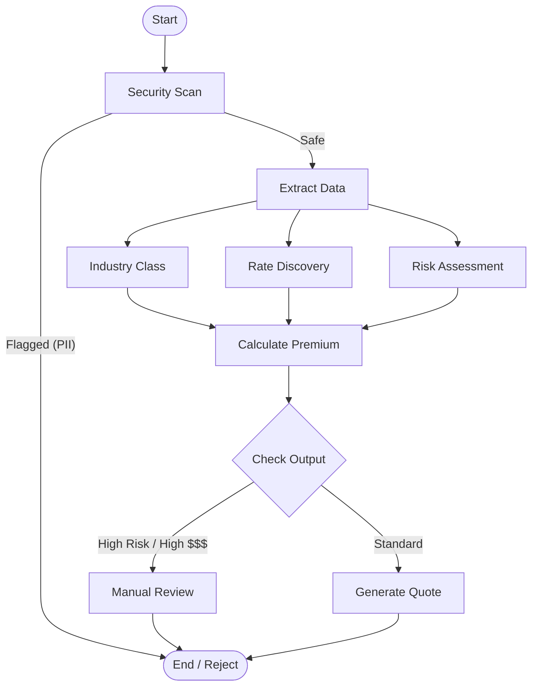

# Project Analysis: AI Insurance Underwriting Orchestrator

## 1. Project Overview
**Goal**: Automate the insurance underwriting process—from email ingestion to quote generation—using AI agents.
**Evolution**: The project has evolved from a linear, regex-based tool into a sophisticated **Agentic Workflow** leveraging LangChain, LangGraph, and LangSmith. It demonstrates how to enforce reliability, security, and human-in-the-loop patterns while automating complex business logic.

## 2. Folder Structure & File Usage

### Root Directory
| File | Usage |
| :--- | :--- |
| `web_app_agentic.py` | **[MAIN ENTRY]** The latest, most advanced Web UI invoking the Agentic Graph. Runs on port 8005. |
| `web_app.py` | The original FastAPI app using the linear/simple pipeline. |
| `web_app_rag_simple.py`| Intermediate version adding basic RAG capabilities. |
| `run_agentic_demo.py` | CLI version of the advanced agentic workflow for terminal usage. |
| `verify_enhancements.py`| Test script to verify the 5 pillars (Security, Reliability, etc.) of the agentic system. |
| `langchain_orchestrator.py`| The core "brain" for the linear pipeline approach. |
| `README.md` | General project documentation and setup guide. |
| `AGENTIC_SUMMARY.md` | Deep dive into the advanced agentic architecture (LangGraph implementation). |
| `TECHNICAL_SUMMARY.md` | Technical overview of the system architecture and linear workflow. |
| `.env` / `.env.example` | Configuration for API keys (Google Gemini, LangSmith, etc.). |

### `src/` Directory (Source Code)
The source code is divided into the "Old" (Linear) and "New" (Graph) approaches.

#### `src/graph_pipeline/` (The New Agentic Core)
This directory contains the StateGraph implementation using LangGraph.
| File | Usage |
| :--- | :--- |
| `graph.py` | Defines the `StateGraph` structure, conditional edges (`route_after_risk`), and parallel execution logic. |
| `nodes.py` | Implements the logic for each node (Security Scan, Extract, Industry, Rates, Calculate, Quote). Uses `RunnableWithFallbacks` for reliability. |
| `state.py` | Defines the `AgentState` TypedDict, managing the data flow between nodes and reducers for parallel updates. |

#### `src/pipeline/` (The Original Linear Pipeline)
| File | Usage |
| :--- | :--- |
| `orchestrator.py` | Manages the sequential execution of steps (1-10). |
| `steps/` | Contains individual class files for each step (e.g., `email_parser.py`, `premium_calculator.py`). |

#### `src/core/` (Shared Utilities)
| File | Usage |
| :--- | :--- |
| `fireworks_client.py` | Client for interacting with LLM APIs (initially Fireworks, now supports Gemini). |
| `mongodb_client.py` | Handles database connections to MongoDB Atlas. |
| `vector_search.py` | Logic for performing RAG/Vector searches in MongoDB. |
| `embedding_service.py` | Service for generating embeddings for text. |

## 3. Workflow Evolution (Based on Chat History)

The project has distinct phases of development, reflected in the file structure:

### Phase 1: The Foundation (Linear Logic)
*   **Goal**: Build a working underwriting tool with deterministic outputs.
*   **Key Files**: `web_app.py`, `src/pipeline/`, `langchain_orchestrator.py`.
*   **Workflow**: Linear 10-step process. Used Regex heavily to ensure math parity with manual calculations.
*   **Chat Context**: Early chats focused on "Building AIUO Web UI", "Refining UI", and "Debugging Backend Logic" to get the math right.

### Phase 2: RAG & LLM Integration
*   **Goal**: Replace rigid logic with AI flexibility while maintaining accuracy.
*   **Key Files**: `web_app_rag_simple.py`, `terminal_demo.py`.
*   **Workflow**: Added "Rate Discovery" via RAG and switched to Google Gemini.
*   **Chat Context**: "Fixing RAG Permissions", "Debugging Google LLM Failures", and "Refining Gemini API Integration". Massive focus on getting the Gemini API to work reliably.

### Phase 3: Advanced Agentic (Current State)
*   **Goal**: Enterprise-grade reliability using the "5 Pillars of Agentic AI".
*   **Key Files**: `web_app_agentic.py`, `src/graph_pipeline/`.
*   **Workflow**:
    *   **Reliability**: Fallback chains for extraction.
    *   **Security**: PII guardrails.
    *   **Performance**: Parallelizing Industry, Rates, and Risk nodes.
    *   **Operation**: Human-in-the-loop for high-risk quotes.
    *   **Observability**: Full integration with LangSmith.
*   **Chat Context**: "Build Advanced Agentic Underwriter" – The most recent major push to restructure the app using LangGraph.

## 4. The Current "Agentic" Workflow
This is the active use case defined in `src/graph_pipeline/graph.py`:



## 5. How to Run the Use Case

1.  **For the Best Experience (Agentic UI)**:
    ```bash
    python web_app_agentic.py
    ```
    *   Access: `http://localhost:8005`
    *   Features: Visualizes the agent's "brain", premium breakdown, and generated artifacts.

2.  **For Testing the Logic (Terminal Only)**:
    ```bash
    python run_agentic_demo.py
    ```

3.  **For Verifying the 5 Pillars**:
    ```bash
    python verify_enhancements.py
    ```
