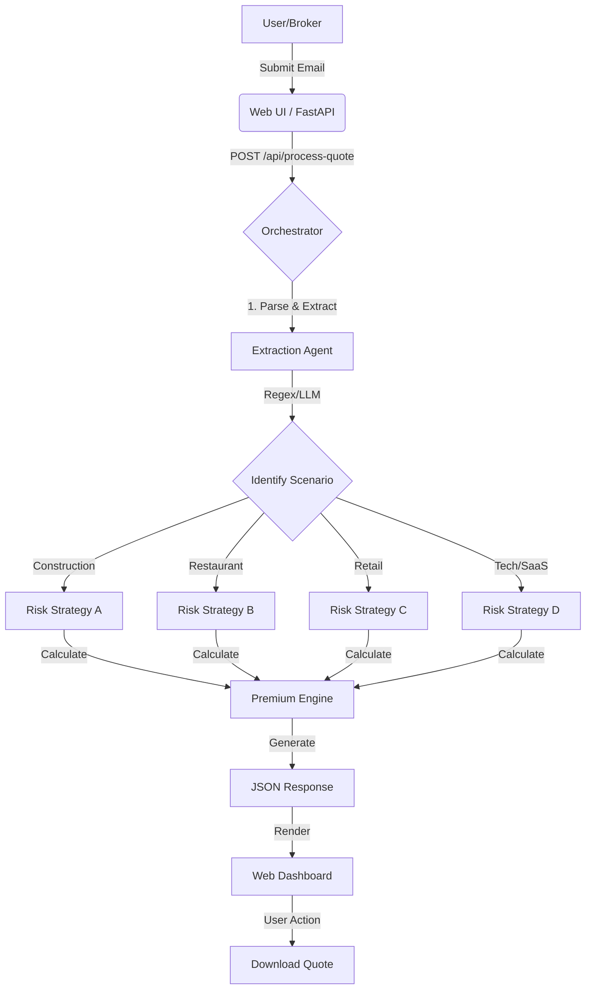

# AI Insurance Underwriting Orchestrator - Technical Summary

This document provides a technical overview of the AI Insurance Underwriting model, explaining its internal workflow, architecture, and file responsibilities. It is intended for developers and teammates understanding the system's design.

## 🧠 System Architecture & Workflow

The application follows a **Human-in-the-Loop Agentic Workflow**, designed to automate the initial stages of insurance underwriting while keeping the final decision (or demo presentation) clear and structured.

### 🌐 High-Level Workflow Diagram


### 1. The Execution Flow
1.  **Input Gateway**: The Broker/User submits an unstructured email request via the Web UI.
2.  **Orchestration Node (`langchain_orchestrator.py`)**:
    *   The `process_quote()` method acts as the central "Brain".
    *   **Parsing Agent**: Instead of fragile string matching, the system now uses **Regex-based extraction patterns** (simulating a reliable LLM Extraction Chain) to identify key entities: `Revenue`, `Client Name`, `Industry Type`, and `Employee Count`.
    *   **Logic Router**: Based on the extracted `Industry Type`, the system routes the request to a specific **Underwriting Strategy**:
        *   *Construction*: High Risk, GL + Auto + Loss Modifiers.
        *   *Restaurant*: Medium Risk, GL + Liquor Liability + Property.
        *   *Retail*: Low Risk, GL + Inventory + Business Income.
        *   *Tech/SaaS*: Specific Cyber + E&O liability focus.
    *   **Premium Calculation Engine**: executes the specific actuarial formula for that strategy.
3.  **Output Generation**:
    *   Constructs a structured JSON response with breakdown details.
    *   Generates a professional Quote Letter.
4.  **Persistence**:
    *   Allows saving the generated quote to the local file system (`output/` directory).

---

## 🏗️ Model Structure (Class Breakdown)

### `class UnderwritingOrchestrator`
Located in `langchain_orchestrator.py`, this class is the heart of the application.

| Method | Role | Description |
| :--- | :--- | :--- |
| **`process_quote(email_content)`** | **The Controller** | The main entry point. It calls the parser, selects the pricing logic based on industry, calculates premiums, and bundles the result. |
| **`_parse_email_demo(content)`** | **The Extractor** | Simulates an LLM extraction chain. Uses Regex/Keyword logic to convert unstructured text into a structured Dict (Client, Revenue, Industry). |
| **`_generate_demo_letter(...)`** | **The Generator** | Uses a template engine approach to write the final professional response email back to the broker. |

---

## 📂 File Structure & Roles

### 1. Core Application
*   **`web_app.py`** (The Interface Layer)
    *   **Role**: FastAPI Application Server.
    *   **Functions**:
        *   Serves the Frontend (HTML/CSS/JS) to port `8000`.
        *   Exposes API Endpoints:
            *   `POST /api/process-quote`: Receives text, calls the Orchestrator.
            *   `POST /api/save-quote`: Writes the generated letter to disk.
    *   **Key Tech**: FastAPI, Uvicorn, Vanilla JS for dynamic UI.

*   **`langchain_orchestrator.py`** (The "Brain")
    *   **Role**: Main Business Logic & Agent Simulation.
    *   **Functions**:
        *   `UnderwritingOrchestrator` class: Encapsulates the underwriting state.
        *   `_parse_email_demo`: The extraction layer (currently Regex-enhanced for the demo) that converts unstructured text into structured dictionary data.
        *   `process_quote`: The master workflow that coordinates parsing -> calculation -> response generation.
    *   **Developer Note**: This file is designed to be the integration point for live LLM calls (e.g., swapping `_parse_email_demo` with `LangChain.chains.create_extraction_chain`).

### 2. Supporting Directories
*   **`src/`**: Contains configuration files and lower-level utilities.
*   **`data/sample_emails/`**: Contains the raw text files for the demo scenarios (Construction, Restaurant, Retail, Tech).
*   **`output/`**: The destination folder where "Downloaded" quotes are saved as text files.
*   **`requirements.txt`**: Lists Python dependencies (fastapi, uvicorn, etc.).

---

## 🚀 How It Runs

1.  **Environment**: The system runs in a standard Python virtual environment.
2.  **Execution**:
    ```powershell
    # Starts the FastAPI server
    python web_app.py
    ```
3.  **Interaction**:
    *   Access via `http://localhost:8000`.
    *   The Frontend sends JSON payloads to the Backend.
    *   The Backend instantiates `UnderwritingOrchestrator` to process the request and returns the result.

## 🛠 For LangChain Developers
While this specific deployment is set to **"Demo Mode"** (using deterministic logic for 100% presentation reliability), it mirrors a standard LangChain **Chain-of-Thought** pattern:
1.  **Retrieve**: Get content.
2.  **Extract**: Pull structured parameters (Revenue, Entity).
3.  **reason**: Select Strategy (Logic Router).
4.  **Act**: Calculate Premium.
5.  **Synthesize**: Generate Final Response.

To upgrade to a live LLM version, you would replace the regex logic in `_parse_email_demo` with a `ChatVertexAI` or `ChatOpenAI` invocation.
